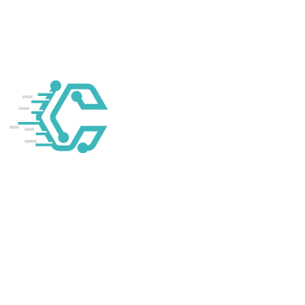

<h1 align="center">
    
    
</h1>

  <i align="center">Code Vault is dynamic web help for developer store books📚</i>

<h4 align="center">
  
  
  
    
   
  
  
  
</h4>

    

## Introduction

`Code-Vault` is a library management system, a web-based application designed to streamline library operations to revolutionize the creation of scalable and secure Spring Boot applications. It helps libraries manage collections, automate tasks, and provide online access to resources.

Our user-friendly interface fosters seamless integration of APIs, data models, databases, authentication, and authorization. Built on a flexible, plugin-based architecture. Benefits of using the `Code-Vault`  include increased efficiency, improved customer service, and enhanced access.

The `Code-Vault` is a powerful tool that can help libraries improve operations and provide better service to patrons🚀🚀.

Experience the fastest way to develop React-Spring Boot applications with Code-Vault 🚩🚩.

 Features

  

    
&nbsp;
    

    
&nbsp;
    

 
    

    
&nbsp;
    

    

## Environment

**- Front-End**:
- **ReactJs 18.2 +**
- **NodeJs 16.18.36 +** (Note: Please use NodeJs version 16.18 or higher)
- **TypeScript 4.9.5 +**

**- Back-End**:
-   **JDK 18 +**
- **Maven 4.0 +**
- **IntelliJ IDEA COMUNITY 2023.3.4 +** (Note: Please use IDEA and make sure plugin lombok installed.)
- **Mysql 8.0.36 +** (Please use version 8.0.36  or higher because mysql has some new features and is not backward compatible at version 8.0.36. Althought this project will try to avoid this incompatibility)
